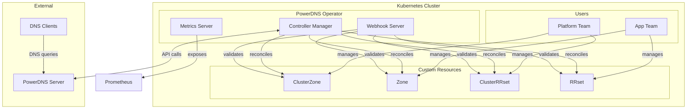
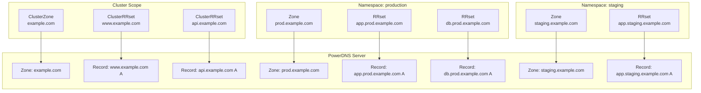
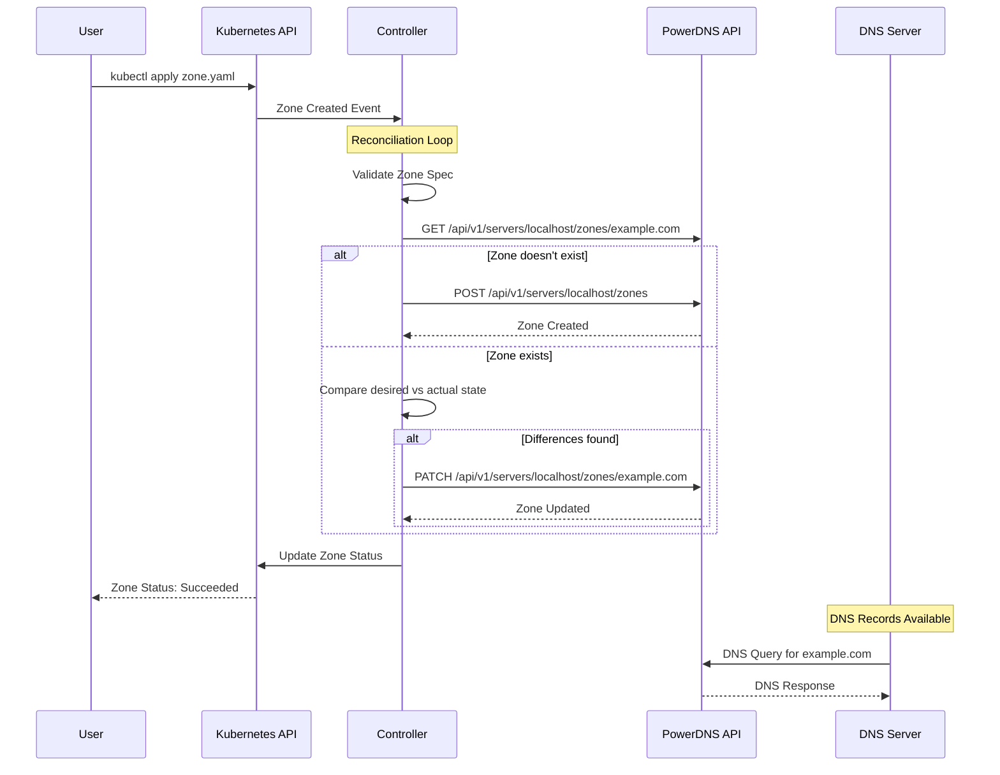
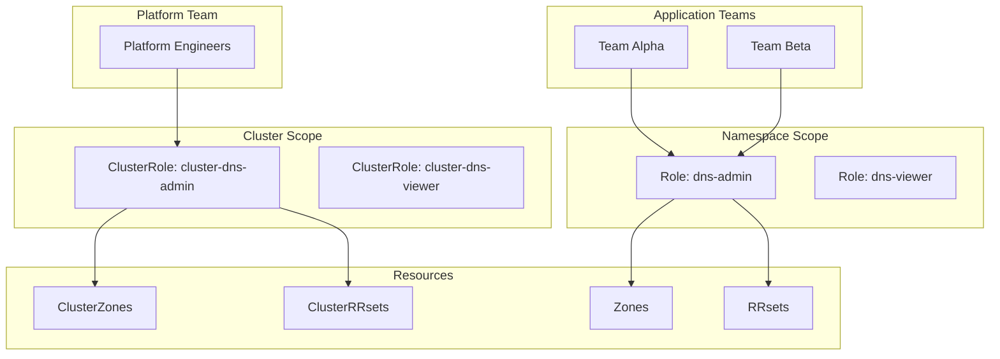
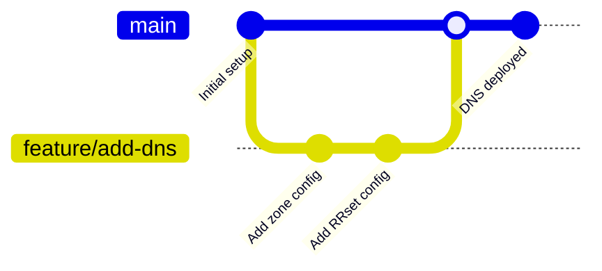

# PowerDNS Operator

<div align="center">


[](https://github.com/powerdns-operator/powerdns-operator/releases)
[](https://goreportcard.com/report/github.com/powerdns-operator/powerdns-operator)
[](https://opensource.org/licenses/Apache-2.0)
[](https://powerdns-operator.github.io/powerdns-operator/)

**Declarative DNS Management for Kubernetes**

</div>

---

**⚠️ This project is a work in progress and is not yet ready for production use.**

PowerDNS Operator is a Kubernetes operator that provides declarative DNS management for PowerDNS Authoritative Server through native Kubernetes Custom Resources. It enables GitOps workflows, self-service DNS capabilities, and enterprise-grade security for DNS infrastructure management.

## 🚀 Features

- **🎯 Declarative Management**: Define DNS zones and records using Kubernetes YAML
- **🔐 Security First**: Built-in connectivity validation, TLS support, and comprehensive RBAC
- **🏢 Multi-tenancy**: Namespace-scoped and cluster-scoped resources
- **📊 Operational Excellence**: Comprehensive logging, metrics, and monitoring
- **🔄 GitOps Ready**: Perfect integration with ArgoCD, Flux, and Infrastructure as Code
- **⚡ Fast Startup**: Automatic PowerDNS connectivity testing and validation
- **🌐 Flexible Deployment**: PowerDNS inside or outside Kubernetes cluster
- **🔍 Rich Observability**: Detailed metrics, events, and status reporting

## 🏗️ Architecture

### High-Level Overview



### Resource Hierarchy



### Reconciliation Flow



## 📋 Requirements

### Supported Versions

| Component | Supported Versions |
|-----------|-------------------|
| **PowerDNS Authoritative** | 4.7, 4.8, 4.9 |
| **Kubernetes** | 1.29, 1.30, 1.31 |
| **Go** (for development) | 1.24+ |

### PowerDNS Configuration

Your PowerDNS Authoritative Server must have the API enabled:

```ini
# /etc/powerdns/pdns.conf
api=yes
api-key=your-secure-api-key
webserver=yes
webserver-address=0.0.0.0
webserver-port=8081
webserver-allow-from=0.0.0.0/0
experimental-json-interface=yes
```

## ⚡ Quick Start

### 1. Install the Operator

```bash
# Create namespace
kubectl create namespace powerdns-operator-system

# Install operator
kubectl apply -f https://raw.githubusercontent.com/powerdns-operator/powerdns-operator/main/dist/install.yaml
```

### 2. Configure PowerDNS Connection

```bash
kubectl create secret generic powerdns-operator-manager \
  --from-literal=PDNS_API_URL=https://powerdns.example.com:8081 \
  --from-literal=PDNS_API_KEY=your-secure-api-key \
  --from-literal=PDNS_API_VHOST=localhost \
  -n powerdns-operator-system
```

### 3. Verify Installation

```bash
# Check operator status
kubectl get pods -n powerdns-operator-system

# Check logs for successful connectivity
kubectl logs -n powerdns-operator-system deployment/powerdns-operator-controller-manager
```

Expected output:
```
INFO Connected to PowerDNS server version=4.8.0
INFO PowerDNS daemon type type=authoritative  
INFO PowerDNS connectivity test successful url=https://powerdns.example.com:8081
```

### 4. Create Your First Zone

```yaml
# zone-example.yaml
apiVersion: dns.cav.enablers.ob/v1alpha2
kind: Zone
metadata:
  name: example.com
  namespace: default
spec:
  kind: Native
  nameservers:
    - ns1.example.com
    - ns2.example.com
```

```bash
kubectl apply -f zone-example.yaml
```

### 5. Add DNS Records

```yaml
# records-example.yaml
apiVersion: dns.cav.enablers.ob/v1alpha2
kind: RRset
metadata:
  name: www-example-com
  namespace: default
spec:
  type: A
  ttl: 300
  records:
    - 192.168.1.100
    - 192.168.1.101
  zoneRef:
    name: example.com
    kind: Zone
---
apiVersion: dns.cav.enablers.ob/v1alpha2
kind: RRset
metadata:
  name: api-example-com
  namespace: default
spec:
  type: CNAME
  ttl: 300
  records:
    - www.example.com
  zoneRef:
    name: example.com
    kind: Zone
```

```bash
kubectl apply -f records-example.yaml
```

### 6. Verify DNS Records

```bash
# Check Kubernetes resources
kubectl get zones,rrsets -o wide

# Test DNS resolution
dig @your-powerdns-server www.example.com
```

## 🔧 Configuration

### Environment Variables

| Variable | Description | Default | Required |
|----------|-------------|---------|----------|
| `PDNS_API_URL` | PowerDNS API endpoint | `http://localhost:8081` | ✅ |
| `PDNS_API_KEY` | PowerDNS API key | `secret` | ✅ |
| `PDNS_API_VHOST` | PowerDNS virtual host | `localhost` | ✅ |

### Advanced Configuration

```yaml
# advanced-config.yaml
apiVersion: v1
kind: ConfigMap
metadata:
  name: powerdns-operator-config
  namespace: powerdns-operator-system
data:
  # Operator configuration
  reconcile-interval: "30s"
  max-concurrent-reconciles: "10"
  
  # PowerDNS settings
  connection-timeout: "10s"
  retry-attempts: "3"
  
  # Logging
  log-level: "info"
  enable-debug: "false"
```

## 📚 Resource Types

### ClusterZone (Cluster-scoped)

Managed by platform teams, available cluster-wide:

```yaml
apiVersion: dns.cav.enablers.ob/v1alpha2
kind: ClusterZone
metadata:
  name: company.com
spec:
  kind: Native
  nameservers:
    - ns1.company.com
    - ns2.company.com
  masters: []  # For slave zones
  account: ""  # PowerDNS account
```

### Zone (Namespace-scoped)

Managed by application teams within their namespace:

```yaml
apiVersion: dns.cav.enablers.ob/v1alpha2
kind: Zone
metadata:
  name: app.company.com
  namespace: production
spec:
  kind: Native
  nameservers:
    - ns1.company.com
    - ns2.company.com
```

### ClusterRRset (Cluster-scoped)

DNS records referencing ClusterZones:

```yaml
apiVersion: dns.cav.enablers.ob/v1alpha2
kind: ClusterRRset
metadata:
  name: www-company-com
spec:
  type: A
  ttl: 300
  records:
    - 203.0.113.10
    - 203.0.113.11
  zoneRef:
    name: company.com
    kind: ClusterZone
```

### RRset (Namespace-scoped)

DNS records within namespace scope:

```yaml
apiVersion: dns.cav.enablers.ob/v1alpha2
kind: RRset
metadata:
  name: api-app-company-com
  namespace: production
spec:
  type: A
  ttl: 300
  records:
    - 10.0.1.100
  zoneRef:
    name: app.company.com
    kind: Zone
```

## 🔒 Security Model

### RBAC Configuration



### Security Best Practices

1. **API Key Management**
   - Use strong, unique API keys (32+ characters)
   - Store in Kubernetes secrets, never in plain text
   - Rotate keys quarterly
   - Monitor API access logs

2. **Network Security**
   - Use TLS for PowerDNS API communication
   - Implement network policies
   - Restrict API access with firewall rules

3. **RBAC Controls**
   - Follow principle of least privilege
   - Separate cluster-wide and namespace-scoped permissions
   - Regular RBAC audits

## 📊 Monitoring and Observability

### Metrics

The operator exposes Prometheus metrics on `:8080/metrics`:

```
# HELP powerdns_zones_total Total number of zones managed
# TYPE powerdns_zones_total gauge
powerdns_zones_total{status="succeeded"} 42

# HELP powerdns_rrsets_total Total number of rrsets managed  
# TYPE powerdns_rrsets_total gauge
powerdns_rrsets_total{status="succeeded"} 156

# HELP powerdns_api_requests_total Total API requests to PowerDNS
# TYPE powerdns_api_requests_total counter
powerdns_api_requests_total{method="GET",status="200"} 1234
```

### Health Checks

```bash
# Readiness probe
curl http://localhost:8081/readyz

# Liveness probe  
curl http://localhost:8081/healthz

# Metrics endpoint
curl http://localhost:8080/metrics
```

### Logging

```json
{
  "level": "info",
  "ts": "2025-01-20T10:30:00Z",
  "logger": "controllers.Zone",
  "msg": "Reconciling Zone",
  "zone": "example.com",
  "namespace": "default"
}
```

## 🛠️ Troubleshooting

### Common Issues

#### 🔴 Connectivity Issues

```bash
# Test PowerDNS API manually
curl -H "X-API-Key: your-api-key" \
     https://powerdns.example.com:8081/api/v1/servers/localhost

# Check operator logs
kubectl logs -n powerdns-operator-system \
             deployment/powerdns-operator-controller-manager -f
```

#### 🔴 Resources Stuck in Pending

```bash
# Check resource status
kubectl describe zone example.com

# Check events
kubectl get events --field-selector involvedObject.name=example.com

# Force reconciliation
kubectl annotate zone example.com powerdns-operator/reconcile="$(date +%s)"
```

#### 🔴 RBAC Errors

```bash
# Check permissions
kubectl auth can-i create zones --as=system:serviceaccount:default:my-user

# View RBAC configuration
kubectl describe clusterrole powerdns-operator-manager-role
```

### Debug Mode

Enable debug logging:

```bash
kubectl patch deployment powerdns-operator-controller-manager \
  -n powerdns-operator-system \
  --type='json' \
  -p='[{"op": "add", "path": "/spec/template/spec/containers/0/args/-", "value": "--zap-log-level=debug"}]'
```

## 🚀 Use Cases

### GitOps Workflow



### Multi-Environment Management

```yaml
# environments/production/dns/
apiVersion: kustomize.config.k8s.io/v1beta1
kind: Kustomization

resources:
  - ../../base/dns/
  
patchesStrategicMerge:
  - zone-production.yaml
  - rrsets-production.yaml

namespace: production
```

### Service Discovery

```yaml
# Automatic DNS for services
apiVersion: dns.cav.enablers.ob/v1alpha2
kind: RRset
metadata:
  name: my-service-dns
  namespace: default
spec:
  type: A
  ttl: 60
  records:
    - "{{ .Values.service.loadBalancerIP }}"
  zoneRef:
    name: services.company.com
    kind: ClusterZone
```

## 🤝 Contributing

We welcome contributions! Please see our [Contributing Guide](CONTRIBUTING.md) for details.

### Development Setup

```bash
# Clone repository
git clone https://github.com/powerdns-operator/powerdns-operator
cd powerdns-operator

# Install dependencies
make install

# Run locally
export PDNS_API_URL=http://localhost:8081
export PDNS_API_KEY=your-dev-key
export PDNS_API_VHOST=localhost
make run
```

## 📖 Documentation

- **[Full Documentation](https://powerdns-operator.github.io/powerdns-operator/)** - Complete guides and references
- **[API Reference](https://powerdns-operator.github.io/powerdns-operator/guides/zones/)** - Detailed resource specifications
- **[Security Guide](https://powerdns-operator.github.io/powerdns-operator/guides/security/)** - Security best practices
- **[Troubleshooting](https://powerdns-operator.github.io/powerdns-operator/guides/troubleshooting/)** - Common issues and solutions

## 📝 License

This project is licensed under the Apache License 2.0 - see the [LICENSE](LICENSE) file for details.

## 🙏 Acknowledgments

- [PowerDNS](https://www.powerdns.com/) - For the excellent DNS server
- [Kubebuilder](https://kubebuilder.io/) - For the operator framework
- [controller-runtime](https://github.com/kubernetes-sigs/controller-runtime) - For the Kubernetes controller library

---

<div align="center">

**Made with ❤️ by the PowerDNS Operator Community**

[Report Bug](https://github.com/powerdns-operator/powerdns-operator/issues) · [Request Feature](https://github.com/powerdns-operator/powerdns-operator/issues) · [Contribute](CONTRIBUTING.md)

</div>