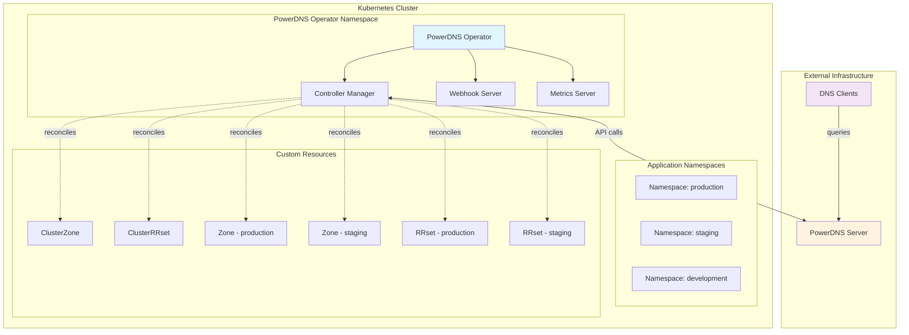
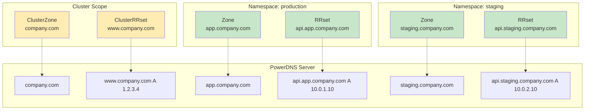

# Advanced Getting Started Guide

This comprehensive guide walks you through setting up PowerDNS Operator with real-world examples, best practices, and troubleshooting tips.

## Prerequisites

Before starting, ensure you have:

- Kubernetes cluster (v1.29+)
- PowerDNS Authoritative Server (v4.7+) with API enabled
- `kubectl` configured for your cluster
- Basic understanding of DNS concepts

## Architecture Overview



## Step 1: PowerDNS Server Setup

### Configure PowerDNS API

Edit your PowerDNS configuration (`/etc/powerdns/pdns.conf`):

```ini
# Basic API Configuration
api=yes
api-key=your-super-secure-api-key-here
webserver=yes
webserver-address=0.0.0.0
webserver-port=8081
webserver-allow-from=0.0.0.0/0
experimental-json-interface=yes

# Production Security Settings
# webserver-address=10.0.0.0/8,192.168.0.0/16
# webserver-allow-from=10.0.0.0/8,192.168.0.0/16
```

### Test PowerDNS API

```bash
# Test API connectivity
curl -H "X-API-Key: your-super-secure-api-key-here" \
     http://your-powerdns-server:8081/api/v1/servers/localhost

# Expected response:
# {
#   "type": "Server",
#   "id": "localhost",
#   "daemon_type": "authoritative",
#   "version": "4.8.0",
#   ...
# }
```

## Step 2: Install PowerDNS Operator

### Method 1: Direct Installation

```bash
# Create namespace
kubectl create namespace powerdns-operator-system

# Install operator
kubectl apply -f https://raw.githubusercontent.com/powerdns-operator/powerdns-operator/main/dist/install.yaml
```

### Method 2: Helm Installation

```bash
# Add Helm repository
helm repo add powerdns-operator https://powerdns-operator.github.io/powerdns-operator
helm repo update

# Install with custom values
helm install powerdns-operator powerdns-operator/powerdns-operator \
  --namespace powerdns-operator-system \
  --create-namespace \
  --set config.pdnsApiUrl="https://your-powerdns-server:8081" \
  --set config.pdnsApiKey="your-super-secure-api-key-here" \
  --set config.pdnsApiVhost="localhost"
```

### Method 3: GitOps with ArgoCD

```yaml
# argocd-application.yaml
apiVersion: argoproj.io/v1alpha1
kind: Application
metadata:
  name: powerdns-operator
  namespace: argocd
spec:
  project: infrastructure
  source:
    repoURL: https://github.com/powerdns-operator/powerdns-operator
    path: chart
    targetRevision: main
    helm:
      values: |
        config:
          pdnsApiUrl: "https://your-powerdns-server:8081"
          pdnsApiVhost: "localhost"
        replicaCount: 2
        monitoring:
          enabled: true
  destination:
    server: https://kubernetes.default.svc
    namespace: powerdns-operator-system
  syncPolicy:
    automated:
      prune: true
      selfHeal: true
    syncOptions:
      - CreateNamespace=true
```

## Step 3: Configure Operator

### Create PowerDNS Connection Secret

```bash
kubectl create secret generic powerdns-operator-manager \
  --from-literal=PDNS_API_URL="https://your-powerdns-server:8081" \
  --from-literal=PDNS_API_KEY="your-super-secure-api-key-here" \
  --from-literal=PDNS_API_VHOST="localhost" \
  -n powerdns-operator-system
```

### Verify Installation

```bash
# Check operator pods
kubectl get pods -n powerdns-operator-system

# Check operator logs
kubectl logs -n powerdns-operator-system deployment/powerdns-operator-controller-manager

# Expected logs should show:
# INFO  Connected to PowerDNS server  version=4.8.0
# INFO  PowerDNS daemon type  type=authoritative
# INFO  PowerDNS connectivity test successful
```

## Step 4: Understanding Resource Types

### Resource Hierarchy



### When to Use Each Resource Type

| Resource Type | Scope | Use Case | Managed By |
|---------------|-------|----------|------------|
| `ClusterZone` | Cluster-wide | Corporate domains, shared zones | Platform Team |
| `ClusterRRset` | Cluster-wide | Global services, infrastructure | Platform Team |
| `Zone` | Namespace | Application-specific domains | Development Teams |
| `RRset` | Namespace | Service endpoints, app records | Development Teams |

## Step 5: Basic Usage Examples

### Example 1: Create a Corporate Zone (Platform Team)

```yaml
# corporate-zone.yaml
apiVersion: dns.cav.enablers.ob/v1alpha2
kind: ClusterZone
metadata:
  name: company.com
  labels:
    team: platform
    criticality: high
  annotations:
    description: "Main corporate domain"
spec:
  kind: Native
  nameservers:
    - ns1.company.com
    - ns2.company.com
---
apiVersion: dns.cav.enablers.ob/v1alpha2
kind: ClusterRRset
metadata:
  name: www-company-com
  labels:
    service: website
spec:
  type: A
  ttl: 300
  records:
    - 203.0.113.10
    - 203.0.113.11
  zoneRef:
    name: company.com
    kind: ClusterZone
  comment: "Corporate website"
```

```bash
kubectl apply -f corporate-zone.yaml
```

### Example 2: Application Team Creates Service DNS

```yaml
# app-dns.yaml
apiVersion: dns.cav.enablers.ob/v1alpha2
kind: Zone
metadata:
  name: myapp.company.com
  namespace: production
  labels:
    team: backend
    environment: production
spec:
  kind: Native
  nameservers:
    - ns1.company.com
    - ns2.company.com
---
apiVersion: dns.cav.enablers.ob/v1alpha2
kind: RRset
metadata:
  name: api-myapp
  namespace: production
spec:
  type: A
  ttl: 60
  records:
    - 10.0.1.100
    - 10.0.1.101
  zoneRef:
    name: myapp.company.com
    kind: Zone
  comment: "API service endpoints"
---
apiVersion: dns.cav.enablers.ob/v1alpha2
kind: RRset
metadata:
  name: db-myapp
  namespace: production
spec:
  type: A
  ttl: 300
  records:
    - 10.0.1.200
  zoneRef:
    name: myapp.company.com
    kind: Zone
  comment: "Database endpoint"
```

```bash
kubectl apply -f app-dns.yaml -n production
```

## Step 6: Advanced Configurations

### Multi-Environment Setup

```bash
# Create environment-specific namespaces
kubectl create namespace production
kubectl create namespace staging
kubectl create namespace development
```

#### Production Environment

```yaml
# production-dns.yaml
apiVersion: dns.cav.enablers.ob/v1alpha2
kind: Zone
metadata:
  name: prod.company.com
  namespace: production
  labels:
    environment: production
    criticality: high
spec:
  kind: Native
  nameservers:
    - ns1.company.com
    - ns2.company.com
  soa_edit_api: EPOCH
---
apiVersion: dns.cav.enablers.ob/v1alpha2
kind: RRset
metadata:
  name: app-prod
  namespace: production
spec:
  type: A
  ttl: 300
  records:
    - 10.100.1.10
    - 10.100.1.11
    - 10.100.1.12
  zoneRef:
    name: prod.company.com
    kind: Zone
  comment: "Production application servers"
```

#### Staging Environment

```yaml
# staging-dns.yaml
apiVersion: dns.cav.enablers.ob/v1alpha2
kind: Zone
metadata:
  name: staging.company.com
  namespace: staging
  labels:
    environment: staging
spec:
  kind: Native
  nameservers:
    - ns1.company.com
    - ns2.company.com
---
apiVersion: dns.cav.enablers.ob/v1alpha2
kind: RRset
metadata:
  name: app-staging
  namespace: staging
spec:
  type: A
  ttl: 60  # Shorter TTL for staging
  records:
    - 10.200.1.10
  zoneRef:
    name: staging.company.com
    kind: Zone
  comment: "Staging application server"
```

### Blue-Green Deployment Pattern

```yaml
# blue-green-dns.yaml
# Blue deployment (active)
apiVersion: dns.cav.enablers.ob/v1alpha2
kind: RRset
metadata:
  name: app-blue
  namespace: production
  labels:
    deployment: blue
    status: active
spec:
  type: A
  ttl: 60
  records:
    - 10.0.10.10
    - 10.0.10.11
  zoneRef:
    name: prod.company.com
    kind: Zone
  comment: "Blue deployment (active)"
---
# Green deployment (standby)
apiVersion: dns.cav.enablers.ob/v1alpha2
kind: RRset
metadata:
  name: app-green
  namespace: production
  labels:
    deployment: green
    status: standby
spec:
  type: A
  ttl: 60
  records:
    - 10.0.11.10
    - 10.0.11.11
  zoneRef:
    name: prod.company.com
    kind: Zone
  comment: "Green deployment (standby)"
---
# Active traffic endpoint
apiVersion: dns.cav.enablers.ob/v1alpha2
kind: RRset
metadata:
  name: app-active
  namespace: production
  labels:
    traffic: active
    deployment-strategy: blue-green
spec:
  type: CNAME
  ttl: 30  # Very short TTL for quick switching
  records:
    - app-blue.prod.company.com
  zoneRef:
    name: prod.company.com
    kind: Zone
  comment: "Active traffic (currently blue)"
```

## Step 7: Monitoring and Observability

### Check Resource Status

```bash
# View all DNS resources
kubectl get clusterzones,zones,clusterrrsets,rrsets --all-namespaces -o wide

# Detailed resource information
kubectl describe zone myapp.company.com -n production

# Check resource events
kubectl get events --field-selector involvedObject.name=myapp.company.com -n production
```

### Monitor Operator Health

```bash
# Check operator metrics
kubectl port-forward -n powerdns-operator-system \
  service/powerdns-operator-controller-manager-metrics-service 8080:8443

curl -k https://localhost:8080/metrics | grep powerdns
```

### Prometheus Monitoring Setup

```yaml
# prometheus-monitoring.yaml
apiVersion: monitoring.coreos.com/v1
kind: ServiceMonitor
metadata:
  name: powerdns-operator
  namespace: powerdns-operator-system
spec:
  selector:
    matchLabels:
      control-plane: controller-manager
  endpoints:
  - port: https
    path: /metrics
    scheme: https
---
apiVersion: monitoring.coreos.com/v1
kind: PrometheusRule
metadata:
  name: powerdns-operator-alerts
  namespace: powerdns-operator-system
spec:
  groups:
  - name: powerdns-operator
    rules:
    - alert: PowerDNSOperatorDown
      expr: up{job="powerdns-operator-controller-manager"} == 0
      for: 5m
      labels:
        severity: critical
      annotations:
        summary: "PowerDNS Operator is down"
    - alert: DNSReconciliationFailed
      expr: increase(controller_runtime_reconcile_errors_total[5m]) > 0
      for: 2m
      labels:
        severity: warning
      annotations:
        summary: "DNS reconciliation failures detected"
```

## Step 8: Security Best Practices

### RBAC Configuration

```yaml
# rbac-example.yaml
# Platform team - full cluster access
apiVersion: rbac.authorization.k8s.io/v1
kind: ClusterRole
metadata:
  name: dns-platform-admin
rules:
- apiGroups: ["dns.cav.enablers.ob"]
  resources: ["clusterzones", "clusterrrsets"]
  verbs: ["*"]
- apiGroups: ["dns.cav.enablers.ob"]
  resources: ["zones", "rrsets"]
  verbs: ["get", "list", "watch"]
---
# Application team - namespace-only access
apiVersion: rbac.authorization.k8s.io/v1
kind: Role
metadata:
  namespace: production
  name: dns-app-admin
rules:
- apiGroups: ["dns.cav.enablers.ob"]
  resources: ["zones", "rrsets"]
  verbs: ["*"]
---
apiVersion: rbac.authorization.k8s.io/v1
kind: RoleBinding
metadata:
  name: app-team-dns-access
  namespace: production
subjects:
- kind: User
  name: app-team-lead
  apiGroup: rbac.authorization.k8s.io
roleRef:
  kind: Role
  name: dns-app-admin
  apiGroup: rbac.authorization.k8s.io
```

### Network Security

```yaml
# network-policy.yaml
apiVersion: networking.k8s.io/v1
kind: NetworkPolicy
metadata:
  name: powerdns-operator-netpol
  namespace: powerdns-operator-system
spec:
  podSelector:
    matchLabels:
      control-plane: controller-manager
  policyTypes:
  - Egress
  egress:
  # Allow DNS resolution
  - ports:
    - protocol: UDP
      port: 53
  # Allow PowerDNS API access
  - to:
    - namespaceSelector: {}
    ports:
    - protocol: TCP
      port: 8081
  # Allow Kubernetes API access
  - to: []
    ports:
    - protocol: TCP
      port: 443
```

## Step 9: Troubleshooting Common Issues

### Issue 1: Operator Won't Start

```bash
# Check pod status
kubectl get pods -n powerdns-operator-system

# Check logs for errors
kubectl logs -n powerdns-operator-system deployment/powerdns-operator-controller-manager

# Common error: Connection refused
# Solution: Verify PowerDNS API is accessible
curl -H "X-API-Key: your-api-key" http://powerdns-server:8081/api/v1/servers/localhost
```

### Issue 2: Resources Stuck in Pending

```bash
# Check resource status
kubectl describe zone example.com -n production

# Check operator logs
kubectl logs -n powerdns-operator-system deployment/powerdns-operator-controller-manager -f

# Force reconciliation
kubectl annotate zone example.com powerdns-operator/reconcile="$(date +%s)" -n production
```

### Issue 3: DNS Records Not Updating

```bash
# Verify PowerDNS server state
curl -H "X-API-Key: your-api-key" \
     http://powerdns-server:8081/api/v1/servers/localhost/zones/example.com

# Compare with Kubernetes resource
kubectl get rrset example-record -o yaml -n production

# Check for conflicts
kubectl get events --field-selector involvedObject.name=example-record -n production
```

## Step 10: GitOps Integration

### Directory Structure

```
dns-config/
├── base/
│   ├── kustomization.yaml
│   ├── cluster-zones.yaml
│   └── rbac.yaml
├── environments/
│   ├── production/
│   │   ├── kustomization.yaml
│   │   ├── zones.yaml
│   │   └── rrsets.yaml
│   ├── staging/
│   │   ├── kustomization.yaml
│   │   ├── zones.yaml
│   │   └── rrsets.yaml
│   └── development/
│       ├── kustomization.yaml
│       ├── zones.yaml
│       └── rrsets.yaml
```

### Base Configuration

```yaml
# base/kustomization.yaml
apiVersion: kustomize.config.k8s.io/v1beta1
kind: Kustomization

resources:
  - cluster-zones.yaml
  - rbac.yaml

commonLabels:
  managed-by: gitops
  component: dns
```

### Environment Overlay

```yaml
# environments/production/kustomization.yaml
apiVersion: kustomize.config.k8s.io/v1beta1
kind: Kustomization

resources:
  - ../../base
  - zones.yaml
  - rrsets.yaml

namespace: production

commonLabels:
  environment: production

patchesStrategicMerge:
  - zone-production-patch.yaml
```

## Next Steps

1. **Explore Advanced Features**
   - [Security Guide](security.md) - Comprehensive security practices
   - [Troubleshooting](troubleshooting.md) - Detailed problem resolution

2. **Production Deployment**
   - Set up monitoring and alerting
   - Implement backup and disaster recovery
   - Configure multi-region deployments

3. **Automation**
   - Integrate with CI/CD pipelines
   - Set up automated testing
   - Implement policy enforcement

4. **Scaling**
   - Optimize for large-scale deployments
   - Implement resource quotas
   - Set up multi-cluster management

## Useful Commands Reference

```bash
# Resource Management
kubectl get clusterzones,zones,clusterrrsets,rrsets --all-namespaces
kubectl describe zone <zone-name> -n <namespace>
kubectl logs -n powerdns-operator-system deployment/powerdns-operator-controller-manager -f

# Debugging
kubectl annotate zone <zone-name> powerdns-operator/reconcile="$(date +%s)" -n <namespace>
kubectl get events --field-selector involvedObject.name=<resource-name> -n <namespace>

# PowerDNS API Testing  
curl -H "X-API-Key: <api-key>" http://<powerdns-server>:8081/api/v1/servers/localhost
curl -H "X-API-Key: <api-key>" http://<powerdns-server>:8081/api/v1/servers/localhost/zones

# Monitoring
kubectl port-forward -n powerdns-operator-system service/powerdns-operator-controller-manager-metrics-service 8080:8443
curl -k https://localhost:8080/metrics | grep powerdns
```

This comprehensive guide should get you started with PowerDNS Operator in any environment, from development to production!