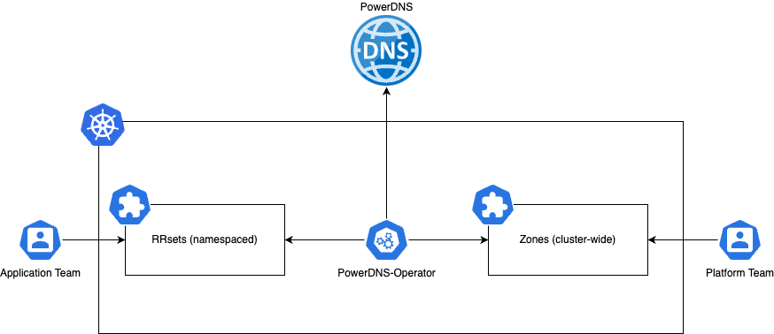

---
hide:
  - toc
---

# PowerDNS Operator Documentation



## What is PowerDNS Operator?

PowerDNS Operator is a Kubernetes operator that bridges the gap between Kubernetes and PowerDNS, enabling you to manage DNS infrastructure using familiar Kubernetes patterns and tools. Instead of manually configuring PowerDNS zones and records, you can now use declarative Kubernetes resources that automatically sync with your PowerDNS server.

## How It Works

The operator follows the standard Kubernetes operator pattern:

1. **Custom Resources**: You define DNS zones and records using Kubernetes Custom Resource Definitions (CRDs)
2. **Reconciliation Loop**: The operator continuously watches for changes to these resources
3. **PowerDNS API**: When changes are detected, the operator translates them into PowerDNS API calls
4. **State Synchronization**: The operator ensures your PowerDNS server matches your Kubernetes declarations

This creates a seamless integration where your DNS infrastructure becomes part of your Kubernetes GitOps workflow.

## Core Concepts

### DNS Zones
Zones represent the top-level domains you want to manage. The operator supports two types:

- **ClusterZones**: Available across all namespaces in your cluster
- **Zones**: Scoped to specific namespaces for better isolation

### DNS Records (RRSets)
Records define the actual DNS entries within zones. Like zones, records can be:

- **ClusterRRSets**: Global records accessible from any namespace
- **RRSets**: Namespace-scoped records for better security and organization

### Resource Relationships
Understanding how resources relate to each other is crucial:

```
ClusterZone (example.com)
├── ClusterRRset (www.example.com)
└── Zone (app.example.com)
    └── RRset (api.app.example.com)
```

## Architecture Overview

The operator consists of several key components:

- **Controllers**: Handle the reconciliation logic for each resource type
- **PowerDNS Client**: Manages communication with the PowerDNS API
- **RBAC Integration**: Provides fine-grained access control
- **Metrics**: Built-in monitoring and observability

## Getting Started

If you're new to PowerDNS Operator, we recommend following this path:

1. **[Overview](introduction/overview.md)** - Understand the architecture and design principles
2. **[Getting Started](introduction/getting-started.md)** - Installation and basic configuration
3. **[Resource Guides](guides/)** - Learn about each resource type in detail
4. **[Examples](snippets/)** - See practical examples and use cases

## Use Cases

PowerDNS Operator is particularly valuable for:

- **GitOps Workflows**: Manage DNS alongside your application deployments
- **Multi-tenant Environments**: Isolate DNS management by namespace
- **Automated DNS**: Generate DNS records from Kubernetes services and ingresses
- **Infrastructure as Code**: Version control your entire DNS infrastructure

## Integration Points

The operator integrates with various Kubernetes and external systems:

- **ArgoCD/Flux**: For GitOps-based DNS management
- **Prometheus**: Built-in metrics and monitoring
- **Kubernetes RBAC**: Fine-grained access control
- **PowerDNS API**: Direct integration with PowerDNS Authoritative Server
